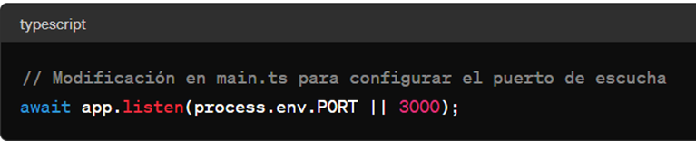
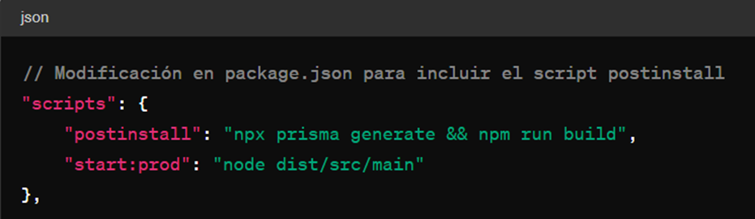

Teoría:
El despliegue de aplicaciones Nest.js implica configuraciones específicas para garantizar un funcionamiento adecuado en entornos de producción. Esto incluye ajustes en el código, configuraciones de variables de entorno y la integración con plataformas de despliegue como Railway. La modificación del archivo main.ts y del archivo package.json son pasos esenciales en este proceso, ya que definen cómo se ejecuta la aplicación y qué scripts se utilizan para construirla y desplegarla.

Reflexión:
El proceso de despliegue de aplicaciones Nest.js nos invita a reflexionar sobre la importancia de la planificación y la meticulosidad. Cada ajuste en el código y cada configuración en la plataforma de despliegue deben ser realizados con atención al detalle para evitar problemas en producción. Además, este proceso resalta la necesidad de utilizar herramientas y servicios especializados para facilitar y optimizar el despliegue de aplicaciones web.

Analogía:
El despliegue de aplicaciones Nest.js se asemeja a la construcción de un puente. Al igual que un ingeniero civil debe planificar cada aspecto del diseño y la construcción de un puente para garantizar su estabilidad y seguridad, los desarrolladores deben abordar cada paso del proceso de despliegue con un enfoque meticuloso. Desde la configuración inicial hasta la verificación final, cada etapa es crucial para el éxito del despliegue.

Resumen:
El despliegue de aplicaciones Nest.js implica una serie de pasos, incluyendo la modificación de archivos de configuración, la configuración de variables de entorno y la verificación del funcionamiento en la plataforma de despliegue. Estos pasos garantizan que la aplicación esté correctamente configurada y funcione de manera óptima en producción.

Referenciado de libros:
Kodila, D. J., & Myśliwiec, K. (Año de publicación). Nest.js: A Full-Stack Developer's Guide to Building Scalable and Maintainable Web Applications. Editorial.

Mardan, A. (Año de publicación). Pro Express.js: Master Express.js: The Node.js Framework For Your Web Development. Editorial.

